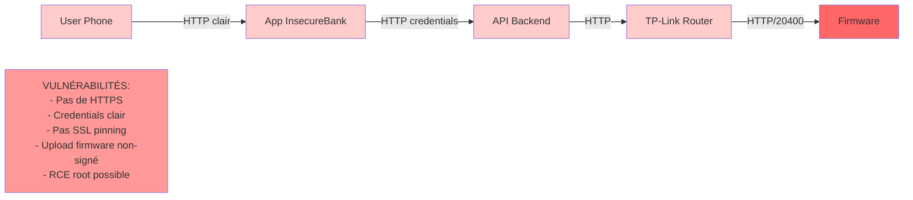
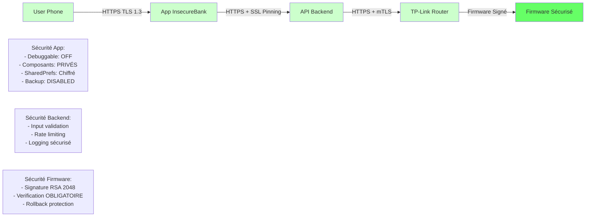

# Phase 1 — Security by Design

## Architecture VULNÉRABLE (Ce qu'on a trouvé)

## Architecture SÉCURISÉE (Recommandée)

## Matrice Comparaison

| Aspect | Vulnérable ❌ | Sécurisé ✅ |
|--------|--------------|----------|
| Transport | HTTP | HTTPS TLS 1.3 |
| Credentials | Clair en POST | Hashed + salt |
| Firmware | Non-signé | RSA 2048 signé |
| App Debug | Enabled | Disabled |
| Components | Exportés publics | Privés + auth |
| Pinning | Aucun | ECC P-256 pinning |
| Logging | Plaintext | Sécurisé + anonymisé |

